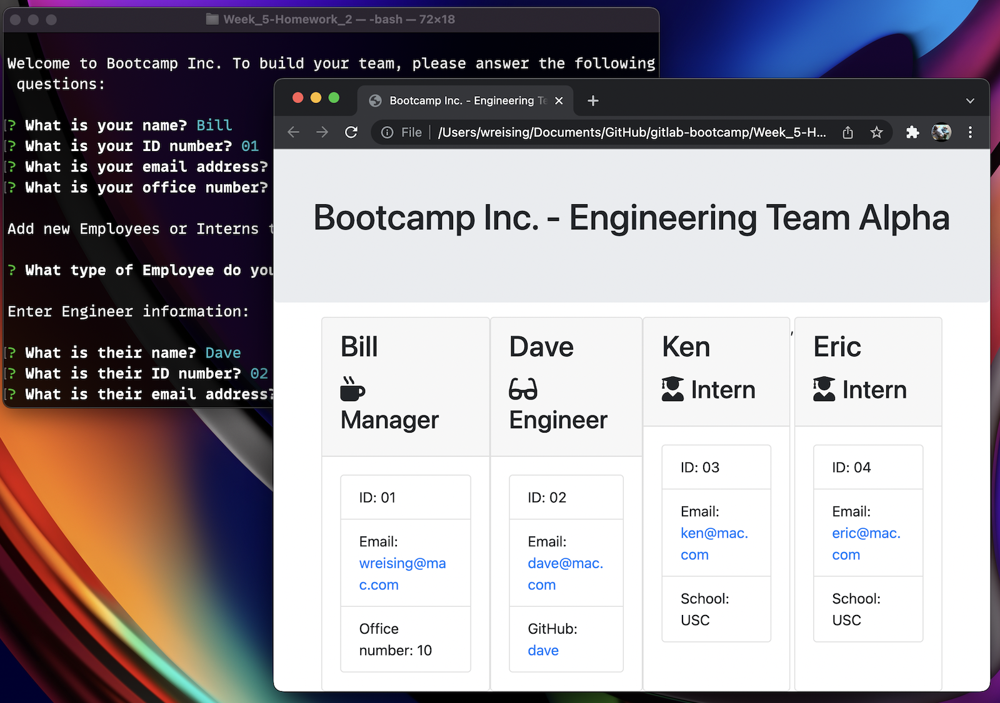

# README - Bootcamp Inc. Team Builder 

### By: [Bill Reising](#questions)

---

## App Description

Command line utility to create a list of a team for Bootcamp Inc. consisting of a Manager and any number of Engineers and Interns. Once the team list has been created, generate a HTML page showing all members of the team by name with their ID number, email, and Office Number, GitHub username, or School as appropriate.

---

> **[Screencast](https://drive.google.com/file/d/1YgWA-ig94EaKYjz4AOZKsRsgg3G-IWt-/view)**

---

---

## Table of Contents
- [Instalation Instructions](#installation-instructions)
- [Command to Use](#command-to-use)
- [Instructions](#instructions)
- [Contribution Guidlines](#contribution-guidlines)
- [Tests](#tests)
- [License](#License-bsd-3)
- [Questions](#Questions)

---

## Installation Instructions

Copy the folder to a server running Node and that has inquirer, jest, fs, and path installed.

## Command to use:

<code>node app.js</code>

## Instructions:

run `node app.js` and answer the questions.

## Contribution Guidlines

Be polite and provide examples.

## Tests

run jest `npm test`

## License: BSD 3

>The BSD 3-clause license allows you almost unlimited freedom with the software so long as you include the BSD copyright and license notice in it (found in Fulltext). You may not use the names of the original company or its members to endorse derived products.

---

## Questions:

Find the source for this project and more on **[GitHub](https://github.com/wreising).**

**[email](wreising@mac.com)** me with any further questions.

---

README generated by [README Generator](https://github.com/wreising/Week_5-Homework_1)

© 2022 William Reising
